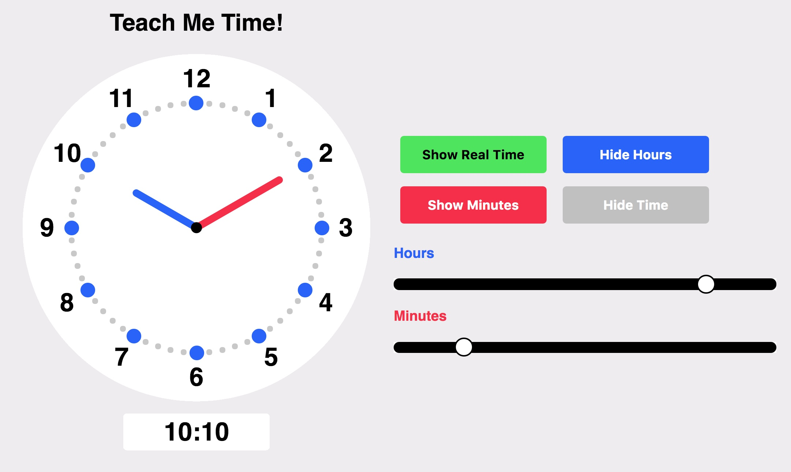

# Teach Me Time!
A simple web app to help your child learn to tell time.

Made with the [p5.js library](https://github.com/processing/p5.js)
Inspired by the clock example on the [processing website](https://processing.org/examples/clock.html)
